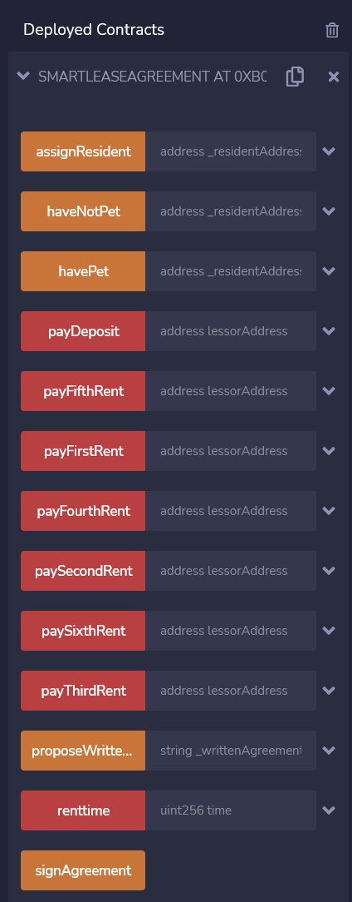
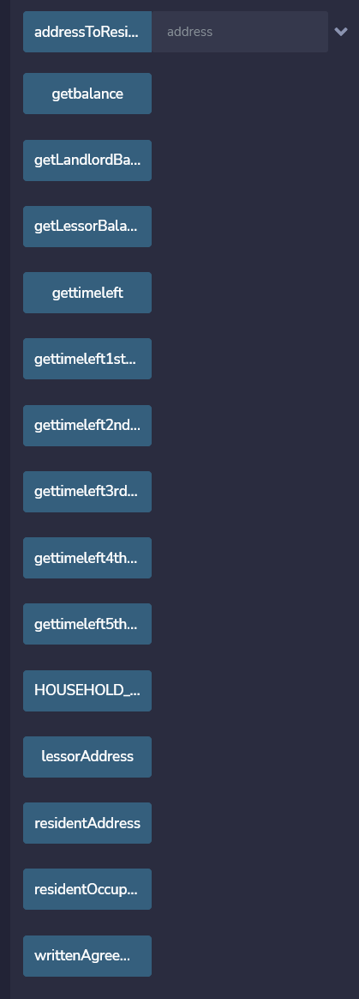

# Project 3: Smart Contract for Real Estate Leases

# 
 The Contract of the Future 

  
 Blockchain leases  . 

## Premise
Our team is developing a Smart Least Contract that we would pitch to 

## Screenshots/Gifs of Contract

Used [Screen to Gif](https://www.screentogif.com/) for the gifs.

## The Buttons And What They Do

* Assign Resident: 
* Have No Pet/Have Pet: 
* Pay Deposit: 
* Pay Nth Rent: 
* Propose Written Agreement: 
* Rent Time: 
* Sign Agreement: 

* Address to Resident: 
* Get Balance:
* Get LandLord Balance: 
* Get Leasee Balancec: 
* Get Time Left: 
* Household Capacity: 
* Lessor Address:
* Resident Address: 
* Resident Occupancy: 
* Written Agreement: 

### Program

### Results
 

## Project Worked on By
* [William Brooks](https://github.com/Wil-bro0824)
* [Jimmy Brown](https://github.com/jbrown2155)
* [Brock Freeman](https://github.com/Bfree22)
* [Benjamin McCright](https://github.com/BenMcCright)
* [David Ready](https://github.com/CrusadingGroundhog)
* [Manolo Serrano](https://github.com/InfluxVC)

## Framework Used
* [Smart Lease Contract Used as Skeleton for our work](https://github.com/SmartLease/Ethereum/blob/master/contracts/smartleasefactory.sol)
